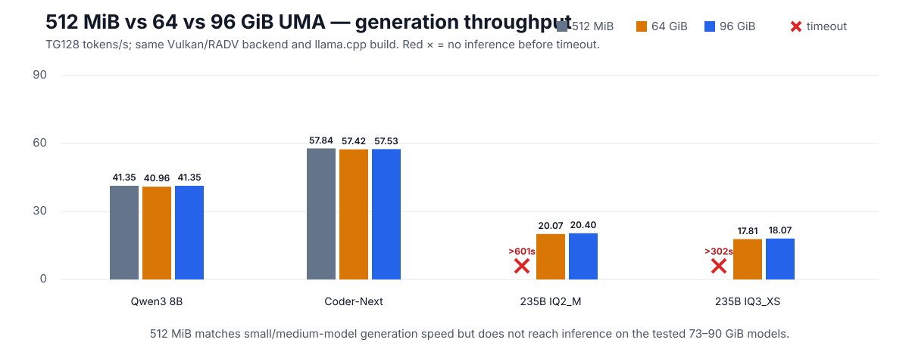
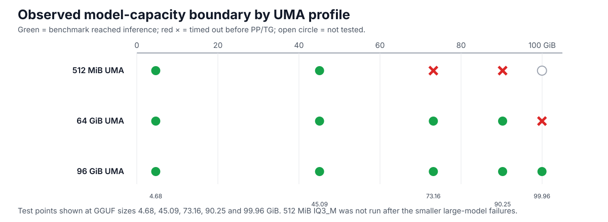
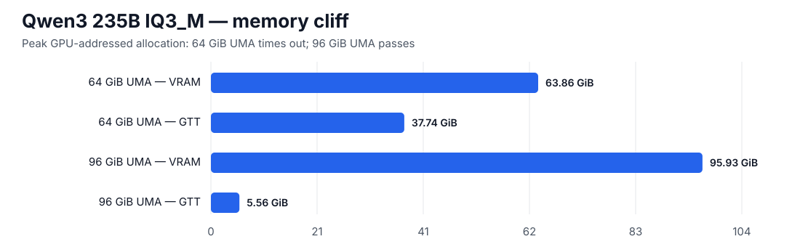
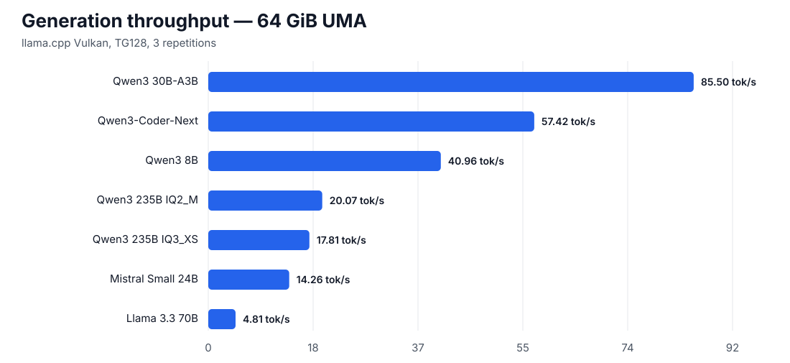

# Bosgame Strix Halo 128 GB — Local LLM Guide

A measured, reproducible guide for running large GGUF models on a **128 GB AMD Strix Halo** system, tested on a Bosgame M5 with a Ryzen AI MAX+ 395 / Radeon 8060S under Ubuntu 24.04.

> **TL;DR:** For an AI-first 128 GB Strix Halo box, **96 GiB UMA (`UMA_SPECIFIED`) + llama.cpp Vulkan + `-ngl 99` + default `load-mode=auto` / `lazy-mode=auto`** is the best tested overall profile. A new three-way test of **512 MiB / 64 GiB / 96 GiB UMA** showed that 512 MiB performs essentially the same on 5–45 GiB models, but hits a severe practical GTT cliff by the ~73 GiB model class. The same 73.16 GiB Qwen3 235B IQ2_M timed out after **601 s** at 512 MiB UMA but completed in **91 s** at 96 GiB UMA at **170.09 tok/s PP512 / 20.40 tok/s TG128**.



## Key findings

- **96 GiB UMA is the best tested AI-first profile** for this 128 GB system: small/mid-size throughput is essentially unchanged while 73–100 GiB GGUFs run cleanly.
- **64 GiB UMA remains the best tested mixed-workstation compromise** if you need substantially more conventional host RAM and can accept a practical ceiling below the ~100 GiB model class.
- **512 MiB UMA is a host-RAM-first profile, not the best large-LLM profile.** It leaves ~124 GiB visible to Linux and is excellent through the tested ~45 GiB class, but 73.16 GiB and 90.25 GiB models timed out under the tested large-GTT path.
- **Qwen3 30B-A3B Q4_K_M** is the measured throughput sweet spot: ~**85.5 tok/s generation**.
- **Qwen3-Coder-Next Q4_K_M** is the measured coding-oriented sweet spot: ~**57.5–57.8 tok/s generation** at ~45 GiB across the tested UMA profiles.
- **Qwen3 235B IQ3_XS** is the measured large-model balance point: ~**18.1 tok/s** at 96 GiB UMA.
- **Qwen3 235B IQ3_M** works at ~**17.1 tok/s** with 96 GiB UMA but crosses a severe memory/reclaim cliff at 64 GiB UMA.
- These are **throughput/capacity benchmarks, not model-quality scores**.



## Tested host

| Component | Measured/tested configuration |
|---|---|
| System | Bosgame M5, 128 GB RAM |
| SoC | AMD Ryzen AI MAX+ 395 |
| GPU | Radeon 8060S / GFX1151 |
| OS | Ubuntu 24.04.5 LTS |
| Kernel | 6.17.0-35-generic |
| Mesa / Vulkan | RADV, GFX1151 |
| llama.cpp | build 11149, commit `d2e54583c` |
| Backend | Vulkan |
| Benchmark | `llama-bench`, PP512 / TG128, 3 repetitions |

## Recommended setup

### BIOS / firmware

For an LLM-first machine:

```text
iGPU Configuration:      UMA_SPECIFIED
UMA Frame Buffer Size:   96G
```

Observed memory layouts on this host:

| BIOS UMA | Linux-visible RAM | Fixed VRAM/UMA | GTT aperture | Vulkan-reported addressable memory |
|---|---:|---:|---:|---:|
| 512 MiB | ~124 GiB | 512 MiB | 114,688 MiB | 115,200 MiB |
| 64 GiB | ~62 GiB | 65,536 MiB | 114,688 MiB | 180,224 MiB |
| 96 GiB | ~30 GiB | 98,304 MiB | 114,688 MiB | 212,992 MiB |

For mixed desktop/VM/container workloads, 64 GiB UMA may be more comfortable. 512 MiB maximizes host-visible RAM, but the measurements below show that a very large GTT aperture is not equivalent to fixed UMA for large-model startup and inference.

**`Auto` was not benchmarked.** Do not assume it selects the same reservation.

### llama.cpp

Build Vulkan support using the upstream-supported `GGML_VULKAN` CMake option. Upstream also documents `-ngl 99` as a way to offload all layers for most models on Vulkan.

```bash
scripts/build-llama-vulkan.sh
```

Recommended runtime defaults from these tests:

```text
GPU layers: 99
Load mode:  auto
Lazy mode:  auto
Backend:    Vulkan / RADV
```

### Swap

The successful test configuration used zram ahead of disk swap:

```text
/dev/zram0  priority 100
/swapfile   priority -2
```

Do not use swap as a substitute for fitting the model. The 512 MiB IQ3_XS failure peaked at ~16.3 GiB swap and 1.33 million major faults, while the cleaner 512 MiB IQ2_M rerun still failed to reach inference after 601 s with **zero swap**, showing that the large-GTT failure cannot be explained by swap alone.

### Kernel/GTT caveat

The measured host booted with:

```text
amdgpu.gttsize=114688 ttm.pages_limit=30720000
```

These flags were **not isolated experimentally**, so they are recorded for reproducibility, not recommended as universal defaults. Current Linux kernel documentation marks `amdgpu.gttsize` as **deprecated**. New users should start with kernel defaults and change advanced memory parameters only with measurements.

## Three-way UMA comparison

Generation throughput where all compared runs reached inference:

| Model | GGUF | 512 MiB UMA | 64 GiB UMA | 96 GiB UMA |
|---|---:|---:|---:|---:|
| Qwen3 8B Q4_K_M | 4.68 GiB | **41.35** | 40.96 | **41.35** |
| Qwen3-Coder-Next Q4_K_M | 45.09 GiB | **57.84** | 57.42 | 57.53 |
| Qwen3 235B IQ2_M | 73.16 GiB | **timeout >601 s** | 20.07 | **20.40** |
| Qwen3 235B IQ3_XS | 90.25 GiB | **timeout >302 s** | 17.81 | **18.07** |
| Qwen3 235B IQ3_M | 99.96 GiB | not run | **timeout >600 s** | **17.05** |

The 512 MiB profile therefore has no meaningful generation-speed advantage on the small/medium models where it succeeds. Its advantage is host RAM availability. Once the working allocation grows into the 73–90 GiB class, the tested GTT-backed path becomes operationally impractical.

### Exact 73.16 GiB IQ2_M comparison

| Qwen3 235B IQ2_M | 512 MiB UMA | 64 GiB UMA | 96 GiB UMA |
|---|---:|---:|---:|
| Result | **timeout >601 s** | pass | **pass** |
| PP512 | — | 163.06 | **170.09** |
| TG128 | — | 20.07 | **20.40** |
| Peak VRAM | 458 MiB | — | **76,128 MiB** |
| Peak GTT | **74,985 MiB** | — | **351 MiB** |
| Minimum available host RAM | 22,308 MiB | — | 18,420 MiB |
| Peak swap | **0 MiB** | — | **0 MiB** |
| Major faults | 1,021 | — | 266 |

The 512 MiB rerun is particularly important: it retained ~22 GiB of available host RAM and used no swap, yet still failed to reach PP/TG after ten minutes. This supports a practical large-GTT allocation/mapping cliff rather than a simple out-of-RAM explanation.

## The ~100 GiB memory cliff

The earlier Qwen3 235B IQ3_M (~99.96 GiB) A/B remains the upper-capacity result:

| IQ3_M | 64 GiB UMA | 96 GiB UMA |
|---|---:|---:|
| Result | timeout >600 s | **pass** |
| PP512 | — | **165.94 tok/s** |
| TG128 | — | **17.05 tok/s** |
| Peak VRAM | 65,395 MiB | 98,233 MiB |
| Peak GTT | 38,645 MiB | 5,697 MiB |
| Minimum available host RAM | 2,678 MiB | 13,264 MiB |
| Peak swap | 4,025 MiB | **0 MiB** |
| Major faults | 193,127 | **0** |



The loader was not the root cause: `load-mode=none / lazy-mode=off` also timed out at 64 GiB UMA. At 96 GiB UMA, both `none/off` and `auto/auto` passed, and `auto/auto` was slightly cleaner.

## Performance snapshot

| Model | Quant | GGUF | UMA | PP512 tok/s | TG128 tok/s |
|---|---|---:|---:|---:|---:|
| Qwen3 8B | Q4_K_M | 4.68 GiB | 96 | 1056.98 | 41.35 |
| Qwen3 30B-A3B | Q4_K_M | 17.35 GiB | 96 | 1279.60 | **85.52** |
| Qwen3-Coder-Next | Q4_K_M | 45.09 GiB | 96 | 747.41 | **57.53** |
| Qwen3 235B-A22B | IQ2_M | 73.16 GiB | 96 | 170.09 | **20.40** |
| Qwen3 235B-A22B | IQ3_XS | 90.25 GiB | 96 | 169.26 | **18.07** |
| Qwen3 235B-A22B | IQ3_M | 99.96 GiB | 96 | 165.94 | **17.05** |
| Mistral Small 3.1 24B | Q4_K_M | 13.35 GiB | 64 | 358.88 | 14.26 |
| Llama 3.3 70B | Q4_K_M | 39.60 GiB | 64 | 106.02 | 4.81 |



## Model recommendations

These are **hardware-efficiency recommendations**, not assertions about task quality.

| Use case | Suggested model / quant | Why |
|---|---|---|
| Fast capable general use | Qwen3 30B-A3B Q4_K_M | ~85.5 tok/s; excellent MoE efficiency |
| Coding / local engineering | Qwen3-Coder-Next Q4_K_M | ~57.5–57.8 tok/s; ~45 GiB footprint |
| Small / low footprint | Qwen3 8B Q4_K_M | ~41 tok/s; ~4.7 GiB |
| Large model, best measured balance | Qwen3 235B IQ3_XS | ~18.1 tok/s; ~90 GiB; negligible GTT at 96 GiB UMA |
| Higher-bit 235B option | Qwen3 235B IQ3_M | ~17.1 tok/s; works cleanly with 96 GiB UMA |
| Smaller 235B footprint | Qwen3 235B IQ2_M | ~20.4 tok/s at 96 GiB UMA; lower-bit quantization |

If a dense model is required for model-quality reasons, use it; however the measured dense models delivered far lower token-generation throughput than the tested MoE models on this machine.

## Reproduce

```bash
# 1. Inspect your machine
scripts/verify-strix-halo.sh

# 2. Build llama.cpp with Vulkan
scripts/build-llama-vulkan.sh

# 3. Optional: download the benchmark model set (hundreds of GiB)
scripts/download-models.sh --list
scripts/download-models.sh

# 4. Run a small control
scripts/strix-halo-bench.sh --model qwen3-8b --capacity

# 5. Run a large-model capacity test
scripts/strix-halo-bench.sh --model qwen3-235b-iq3xs --capacity
```

For the 73–100 GiB class, 96 GiB UMA is strongly recommended based on the measurements in this repo.

## Repository layout

```text
scripts/   build, verify, downloader, benchmark harness
data/      normalized benchmark CSV
graphs/    generated SVG charts
docs/      detailed guide and methodology
```

## Important limitations

- One physical 128 GB Bosgame/Strix Halo machine was measured; firmware, cooling, RAM topology and kernels may differ.
- Model filenames/repos can change.
- PP512 and TG128 are synthetic throughput tests. They are not end-to-end chat latency, TTFT at long context, or quality benchmarks.
- Context scaling and KV-cache pressure at 8K/32K/64K were not measured here.
- `Auto` BIOS UMA mode was not measured.
- The 512 MiB test used the same unusually large 114,688 MiB GTT aperture as the other profiles; do not generalize this result to all kernel/driver configurations.
- No claim is made that Vulkan is faster than HIP/ROCm; this guide documents a known-good Vulkan path.

## Upstream references

- llama.cpp build documentation: https://github.com/ggml-org/llama.cpp/blob/master/docs/build.md
- llama.cpp server/CLI load-mode documentation: https://github.com/ggml-org/llama.cpp/blob/master/tools/server/README.md
- Linux AMDGPU module parameters: https://docs.kernel.org/gpu/amdgpu/module-parameters.html

## License

MIT for scripts and documentation in this repository. Model licenses remain those of their respective model publishers.
