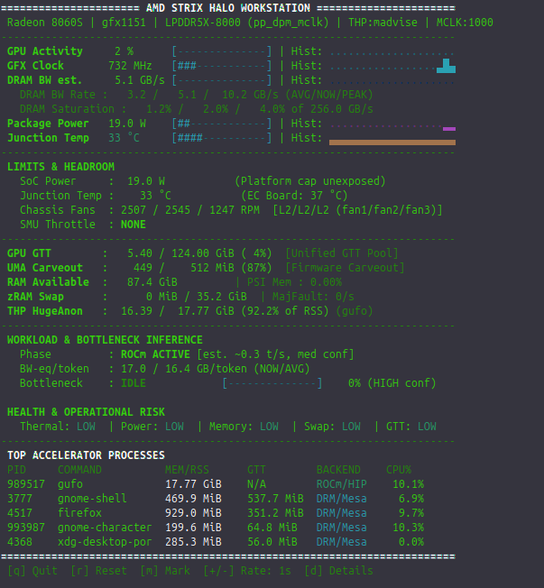

# Bosgame M5 tools: halo-top and fan control

This repository includes two complementary tools developed and validated while tuning the 128 GB Bosgame M5 / Strix Halo workstation.

## 1. halo-top — telemetry and LLM bottleneck monitor

Source: **tools/halo-top/halo-top**

Gufo is loaded at low GPU activity in this capture. Displayed bandwidth and token-rate estimates are not measured inference throughput.

Install on Ubuntu 24.04+:

~~~bash
sudo apt update
sudo apt install python3 procps ncurses-bin dmidecode

git clone https://github.com/ddifofeu/strix-halo-128gb-llm-guide.git
cd strix-halo-128gb-llm-guide/tools/halo-top
bash install.sh
~~~

Run:

~~~bash
halo-top
~~~

Logging/benchmark examples:

~~~bash
halo-top --log ~/halo.csv
halo-top --jsonl ~/halo.jsonl
halo-top --benchmark 60
~~~

halo-top is read-only with respect to fan control. When the community Bosgame EC driver is loaded it can display EC temperature and three fan channels, but it does not change them.

The displayed DRAM bandwidth is explicitly an estimate. It is useful as a relative saturation signal and should not be presented as a hardware byte counter.

## 2. m5fans — Bosgame M5 fan control

Source: **tools/bosgame-m5-fans/**

Install prerequisites and run the read-only diagnostic first:

~~~bash
sudo apt update
sudo apt install python3 python3-tk build-essential git kmod "linux-headers-$(uname -r)"

cd strix-halo-128gb-llm-guide/tools/bosgame-m5-fans
python3 m5fans.py diagnose
python3 -m unittest -v
bash install.sh
~~~

The installer fetches the **cmetz/ec-su_axb35-linux** driver at pinned commit **f62c2c228959a08683273a26ef3afd8991e69f6d**, builds it for the running kernel, loads it, and installs /usr/local/bin/m5fans. It does not enable a persistent fan profile or boot service.

On the validated Linux 6.18.7 mainline kernel, GCC 15 was required to match the kernel build toolchain. If the installer reports that gcc-15 is missing, see the fan tool README before adding any compiler PPA.

Initial channel verification:

~~~bash
sudo m5fans manual 100 --fan fan1 --seconds 15
sudo m5fans manual 100 --fan fan2 --seconds 15
sudo m5fans manual 100 --fan fan3 --seconds 15
sudo m5fans auto
~~~

Then, if all channels respond correctly:

~~~bash
sudo m5fans profile balanced
# or
sudo m5fans profile cool
~~~

Do not run another fan controller at the same time. Manual tests are deliberately timed and attempt to restore firmware-auto mode on normal termination.

## Validated M5 baseline

Both tools were exercised on the repository's Bosgame M5 baseline: Ryzen AI MAX+ 395 / Radeon 8060S, 128 GB, board AXB35-02, BIOS 1.07, Ubuntu 24.04.5 and Linux 6.18.7 with upstream amdgpu. Fan-control validation confirmed the driver loaded and exposed three channels with live RPM/mode/level readback.

This remains a single-machine validation, not a manufacturer compatibility claim for every Bosgame M5 BIOS/EC revision.
