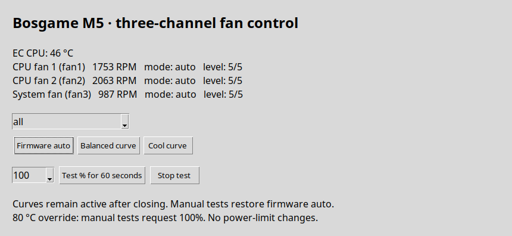

# Bosgame M5 fan control — version 0.2

A Linux CLI/desktop frontend for the three fan channels exposed by the community **ec_su_axb35** kernel driver. It is a custom tool, not an official Bosgame utility. The frontend writes only through the driver's sysfs interface; it does not probe raw EC registers or change APU power limits.

The installer fetches the upstream driver from **cmetz/ec-su_axb35-linux** and pins commit **f62c2c228959a08683273a26ef3afd8991e69f6d** for reproducibility. The driver remains GPL-2.0; this frontend is MIT licensed.

Screenshot from the tested M5, cropped to remove window chrome; application pixels are unchanged.

## Validated platform

Hardware validation performed on:

- Bosgame BeyondMax Series
- board AXB35-02
- BIOS 1.07
- Ubuntu 24.04.5
- Linux 6.18.7-061807-generic
- three driver-exposed fan channels detected and RPM/mode/level read back

That does not guarantee compatibility with every M5 firmware revision. Run the read-only diagnostic first and do not bypass the identity check on another board.

## Install

~~~bash
sudo apt update
sudo apt install python3 python3-tk build-essential git kmod "linux-headers-$(uname -r)"

cd tools/bosgame-m5-fans
python3 m5fans.py diagnose
python3 -m unittest -v
bash install.sh
~~~

The installer must be run as your normal user. It requests sudo only for module installation/loading and for copying /usr/local/bin/m5fans.

### Mainline-kernel compiler note

The installer checks the GCC family recorded by the running kernel. On the validated Ubuntu 24.04 + Linux 6.18.7 mainline kernel, the kernel was built with **gcc-15**. If gcc-15 is not available, install it before rerunning. One Ubuntu 24.04 route is the Ubuntu Toolchain test PPA; review that repository before adding it because it can update GCC runtime libraries:

~~~bash
sudo add-apt-repository -y ppa:ubuntu-toolchain-r/test
sudo apt update
sudo apt install gcc-15
~~~

### Secure Boot

Secure Boot can reject a locally built unsigned module. This installer does not disable Secure Boot or enroll keys. Use Ubuntu's normal module-signing/MOK procedure if required; do not force-load the module.

There is currently no DKMS integration, so rebuild/reinstall the driver after a kernel change if the module is no longer available for the running kernel.

## Use

~~~bash
m5fans status
sudo m5fans gui

sudo m5fans manual 100 --fan fan1 --seconds 15
sudo m5fans manual 100 --fan fan2 --seconds 15
sudo m5fans manual 100 --fan fan3 --seconds 15

sudo m5fans profile balanced
sudo m5fans profile cool --fan fan3

sudo m5fans manual 60 --fan all --seconds 60
sudo m5fans auto
~~~

Percentages map to the driver's five levels; they are not calibrated percentages of measured maximum RPM. Manual choices are intentionally limited to 40/60/80/100%, for 1–300 seconds. During a timed manual run, a temperature reading >=80 °C requests level 5 (100%) for the selected channels. Normal exit, Ctrl+C, SIGTERM and SIGHUP attempt to restore firmware auto.

## Profiles

| Profile | Ramp-up °C for 20/40/60/80/100% | Ramp-down °C |
|---|---|---|
| balanced | 0,40,60,72,82 | 0,35,55,67,77 |
| cool | 0,30,50,65,75 | 0,25,45,60,70 |

These are user-space tuning choices, not manufacturer-qualified curves. Do not run another fan controller concurrently. Test each channel at idle and verify actual RPM/noise/temperature response before a long compute workload.

## Remove

~~~bash
sudo m5fans auto
sudo rm /usr/local/bin/m5fans
sudo modprobe -r ec_su_axb35
~~~

The installed kernel module file remains on disk. If you also want to remove it, inspect the exact path first with **modinfo -n ec_su_axb35**, remove only that file, and run **sudo depmod -a**.

## Provenance

Driver: https://github.com/cmetz/ec-su_axb35-linux

Pinned commit: **f62c2c228959a08683273a26ef3afd8991e69f6d**

The upstream driver still contains TODOs around some EC I/O error handling; a successful sysfs write/readback is therefore not an independent hardware safety guarantee. Never depend on this software as a hardware watchdog.
